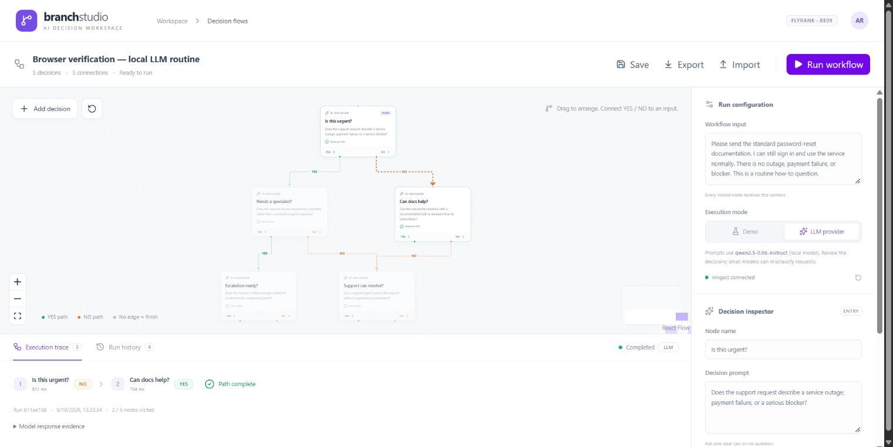
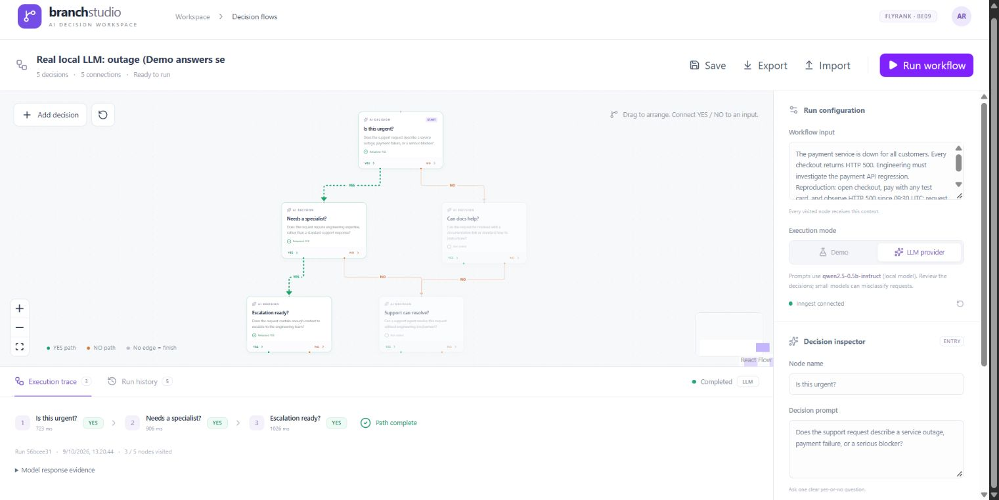
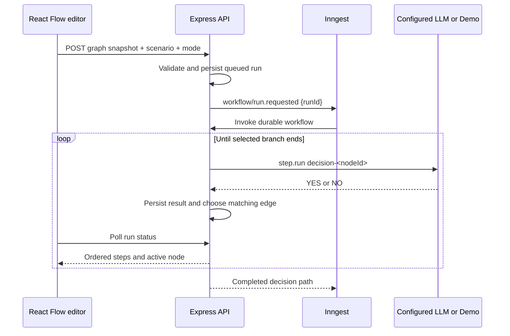

# Branch Studio — AI Decision Flow

Source repository: [ardiradi/flyrank-ai-decision-flow](https://github.com/ardiradi/flyrank-ai-decision-flow).

FlyRank Backend AI Engineering assignment **BE09: AI Decision Flow**. A visual decision workflow editor built with **React + TypeScript, React Flow, shadcn/ui, Express, Inngest, and the official OpenAI SDK**.

Design an acyclic graph of AI questions. Give every decision an optional YES and NO edge. Run the graph against a scenario; Inngest evaluates one node at a time and follows only the matching edge. An answer without a matching edge ends the run.

## Run locally

Requires Node.js 22.12+ (tested with Node.js 24.14.1), npm, and two terminals for Demo. Free local model inference uses an additional model-server terminal; follow [LOCAL_LLM.md](LOCAL_LLM.md).

```powershell
npm install
if (-not (Test-Path -LiteralPath .env)) { Copy-Item -LiteralPath .env.example -Destination .env }
npm run dev
```

In the second terminal:

```powershell
npm run dev:inngest
```

Open [Branch Studio](http://127.0.0.1:5174). The Express API runs on `127.0.0.1:3002`; the local [Inngest dashboard](http://127.0.0.1:8289) runs on port `8289`. Ports intentionally avoid common 3000/5173 development servers.

Inngest may allocate its separate connect-gateway service to port `8290`; the dashboard and event API remain on `8289`.

## Demo and real AI mode

**Demo is an explicit simulation, not an LLM result.** Each node's configured `Demo answer` determines YES or NO. The graph still runs through actual Inngest events and durable steps. This lets you verify both branches without an API key or paid API usage.

For free real inference, follow the [pinned local Qwen setup](LOCAL_LLM.md). It uses the official OpenAI SDK with a localhost-compatible Responses endpoint and an ignored nonsecret placeholder key.

For optional hosted OpenAI inference, add a valid key in the server-only `.env`:

```dotenv
OPENAI_API_KEY=your_api_key
OPENAI_MODEL=gpt-4.1-mini
```

Restart the API, choose **LLM provider**, and check the displayed model/provider. The key never enters frontend code or workflow exports. Every visited node sends its prompt, scenario, and previous YES/NO results to the Responses API with `store: false`. Two balanced generic examples clarify the evaluation format; local inference uses `temperature: 0`. The server accepts exactly `YES` or `NO` after whitespace trimming and fails on other output. Durable steps retain raw answers, model, response/output IDs, and token usage; expand **Model response evidence** to inspect them.

On **9 October 2026**, actual local Qwen inference passed two production SDK smoke calls and two Inngest workflow events containing five distinct visited-node model calls. See [real-provider evidence](evidence/real-provider-verification.json). The workflow Demo answers intentionally oppose the model results, confirming that real execution uses the LLM. Hosted OpenAI has not been exercised. The original Demo evidence remains separate and records `openaiCallsMade: false`.

This 0.5B model is a learning-demo choice. It incorrectly marked a cosmetic theme-change request urgent in a separate probe; [all five probes, including the failure](evidence/local-model-limitations.json), are retained. The selected workflow scenarios verify execution and routing, rather than general classification accuracy.

## Editor workflow

1. Start with the five-node support-triage example, or import a workflow JSON.
2. Click **Add decision**; select the new node and edit its name and YES/NO question in the inspector.
3. Drag a green **YES** or orange **NO** handle into another node's top input. Each result can have at most one outgoing edge. Select an edge and press Delete to reconnect it.
4. Set the entry node. Every node must be reachable from this entry; loops are rejected.
5. Configure a scenario and execution mode; click **Run workflow**.
6. Inspect live node states, animated taken edges, order, timings, and durable run history. Use **Retry** on a failed run after fixing the configuration.

**Save** stores the graph in browser local storage. **Export** and **Import** exchange validated version-1 JSON. API run snapshots and the last 100 finished runs are persisted under ignored `.data/runs.json`; existing run input and graph snapshots are immutable. A user retry creates a new run ID linked to the previous one.

## Assignment coverage

| Phase | Implementation |
| --- | --- |
| 1 — Setup | React/Vite + TypeScript; React Flow; configured shadcn/ui Button, Badge and Card components; Tailwind; Express; Inngest; OpenAI; environment template; README |
| 2 — Visual workflow | Add/remove/drag decision nodes, editable prompts, YES/NO source handles, entry selection, graph state, connection rules |
| 3 — Execution | API sends `workflow/run.requested`; every visited node runs in named `step.run("decision-<id>")`; strict YES/NO parsing; selected branch only; ordered results |
| 4 — Polish | Live execution state; logs/trace with duration and order; save/load; JSON import/export; input and graph error handling; automatic durable retries; failed-run retry; animated edges; persisted history; responsive layout |

## Verification

```powershell
npm test
npm run build
npm run verify:integration
# With the documented local model and local-provider API configured:
npm run verify:provider
```

Both verification commands require the API and Inngest Dev Server. `verify:integration` uses **Demo**, checks both paths plus invalid graph/completed-run retry rejection, and writes `evidence/integration-verification.json`. `verify:provider` accepts the documented local provider, invokes the production SDK evaluator, then sends two real-provider events. It checks five distinct response IDs, raw answers, selected node order, skipped branches, and opposing Demo answers, writing `evidence/real-provider-verification.json`.

**15 unit/API tests passed** on 9 October. They cover selected path order, previous decision context, terminal nodes, durable replay including provider evidence, provider failure, strict model-output parsing, invalid references, cycles, branch ambiguity, disconnected nodes, JSON round trips, duplicate IDs, size limits, and malformed API requests. TypeScript checks and the Vite production build passed.

A fresh workflow triggered in Chrome also completed with actual local model answers `urgency:NO → self-service:YES`, independently verified against its returned event and response IDs. See [Chrome verification](evidence/chrome-provider-verification.json).





## Architecture and recovery



Inngest retries each failed step up to twice. Completed steps are memoized by the engine. UI polling continues through `retrying`; after retries are exhausted, `onFailure` marks the run failed. A full user retry creates a fresh immutable snapshot rather than editing the original run. Restarting the API preserves local history; the default in-memory Inngest Dev Server does not preserve its engine state after its own restart.

The JSON file store suits a single local assignment instance. For a public or multi-instance deployment, add authenticated users, ownership checks, request quotas, and a shared transactional database before exposing the run API. The default API binds only to localhost.

## Production build

```powershell
npm run build
npm start
```

The API serves the compiled frontend from `dist/` on port `3002`. Inngest must still be running locally, or configured in Cloud using `INNGEST_DEV=0`, `INNGEST_EVENT_KEY`, and `INNGEST_SIGNING_KEY`, with the deployed `/api/inngest` URL registered. Do not publish `.env` or `.data/`.

## Submission/demo checklist

- Repository/source: this complete project, including lockfile, README, tests, and sample workflow.
- Show the graph editor, prompt edit, new node connection, and export/import.
- Run the example in Demo; show its YES path and skipped nodes.
- Change the entry node's Demo answer to NO; show the alternate path.
- Open the Inngest dashboard and show the `execute-decision-workflow` run trace and named steps.
- Configure the documented local model, switch to **LLM provider**, and show both real-provider history entries and their response evidence.
- Mention the 15 tests, successful build, five actual workflow model calls, and the retained misclassification. Keep local-Qwen and hosted-OpenAI verification claims precise.

## Primary implementation references

- [React Flow custom nodes](https://reactflow.dev/learn/customization/custom-nodes)
- [Inngest Express quick start](https://www.inngest.com/docs/getting-started/express-quick-start)
- [Inngest step.run](https://www.inngest.com/docs/reference/functions/step-run)
- [OpenAI text generation / Responses API](https://developers.openai.com/api/docs/guides/text)
- [shadcn/ui Vite setup](https://ui.shadcn.com/docs/installation/vite)
